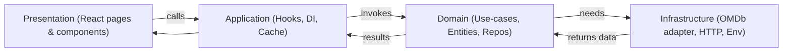
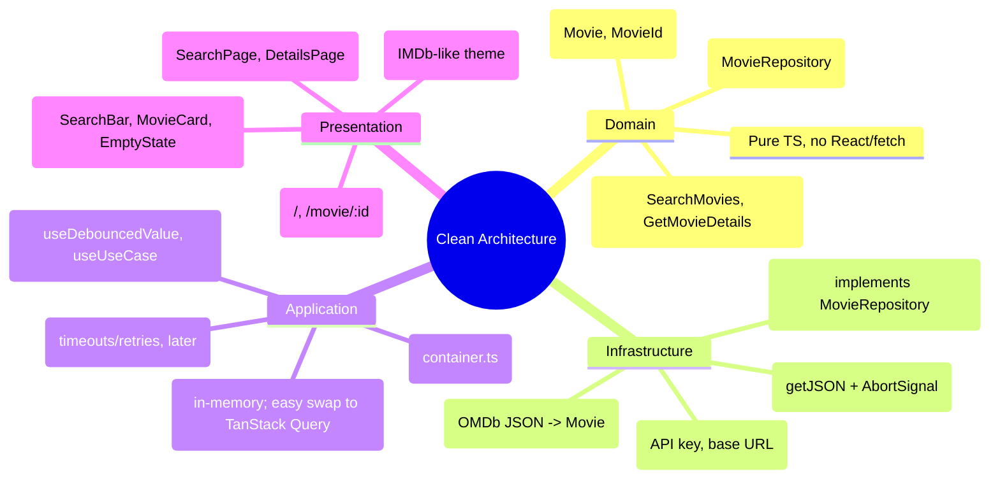
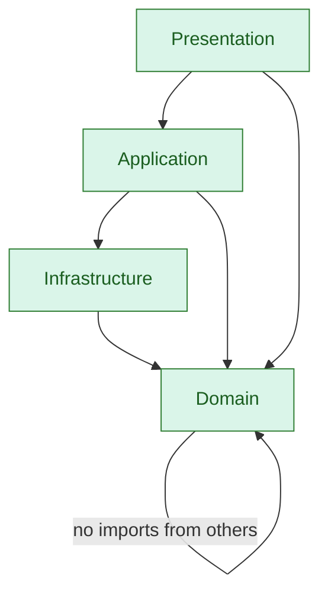
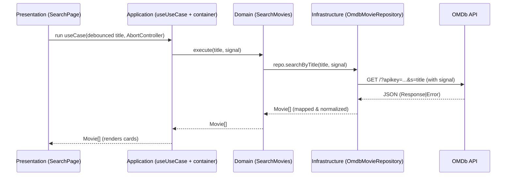
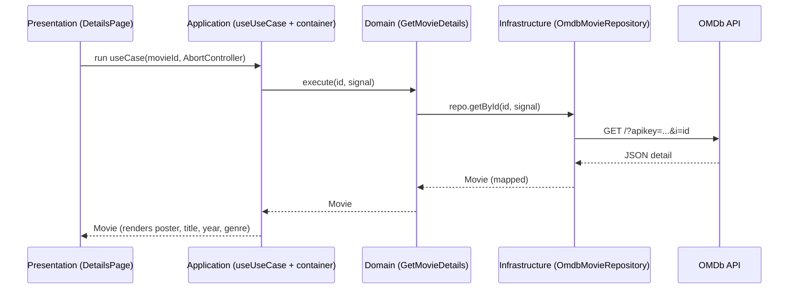

# Movies App — React 19.1 + Clean Architecture

A portfolio-ready React (19.1) project structured with **Clean Architecture**. It searches movies via OMDb, shows details, and demonstrates layered separation (Domain → Infrastructure → Application → Presentation). Tailwind v4 is used for styling.

---

## Table of Contents
- [Goals](#goals)
- [Architecture Overview](#architecture-overview)
- [Layer Responsibilities](#layer-responsibilities)
- [Dependency Rule](#dependency-rule)
- [Request Flow](#request-flow)
- [Folder Structure](#folder-structure)
- [How to Run](#how-to-run)
- [Environment](#environment)
- [Styling (Tailwind v4)](#styling-tailwind-v4)
- [Error Handling & Performance](#error-handling--performance)
- [Testing Strategy](#testing-strategy)
- [Extending the App](#extending-the-app)

---

## Goals
- **Clean separation of concerns** (pure domain, swappable infra, thin UI).
- **Portfolio clarity**: easily explain *what lives where* and *why*.
- **Good UX**: debounced search, back/forward-friendly details view.
- **Resilience**: clear error messages, graceful handling of OMDb limits.

---

## Architecture Overview



**High-level idea:** The **Domain** declares *what* data/actions are needed (interfaces + use-cases). The **Infrastructure** provides the *how* (HTTP calls, mapping). The **Application** wires everything and provides cross-cutting UX helpers (debounce, abort, cache). The **Presentation** just renders.

---

## Layer Responsibilities



**Plain-English analogy:**  
- **Domain** = the menu of what you can do.  
- **Infrastructure** = the kitchen that knows how to do it (OMDb calls).  
- **Application** = the waiter that coordinates & adds service polish (debounce/cache).  
- **Presentation** = the dining area/UI that shows the results.

---

## Dependency Rule



- **Domain** depends on nothing app-specific.  
- **Infrastructure** implements **Domain** contracts.  
- **Application** wires **Domain ↔ Infrastructure** and exposes convenient hooks/services.  
- **Presentation** talks to **Application/Domain**, never directly to the API layer.

---

## Request Flow

### Search flow


### Details flow


---

## Folder Structure

```
src/
├─ domain/
│  ├─ entities/
│  │  └─ Movie.ts
│  ├─ repositories/
│  │  └─ MovieRepository.ts
│  └─ usecases/
│     ├─ SearchMovies.ts
│     └─ GetMovieDetails.ts
├─ infrastructure/
│  ├─ http/
│  │  └─ httpClient.ts
│  ├─ omdb/
│  │  ├─ OmdbMovieRepository.ts
│  │  └─ omdbMapper.ts
│  └─ config/
│     └─ env.ts
├─ application/
│  ├─ di/
│  │  └─ container.ts
│  ├─ cache/
│  │  └─ memoryCache.ts
│  └─ hooks/
│     ├─ useDebouncedValue.ts
│     └─ useUseCase.ts
├─ presentation/
│  ├─ router/
│  │  └─ routes.tsx
│  ├─ pages/
│  │  ├─ SearchPage.tsx
│  │  └─ DetailsPage.tsx
│  ├─ components/
│  │  ├─ SearchBar.tsx
│  │  ├─ MovieCard.tsx
│  │  └─ EmptyState.tsx
│  └─ styles/
│     └─ index.css   (if you keep per-feature styles; Tailwind v4 entry is src/index.css)
├─ App.tsx
├─ main.tsx
└─ index.css          (Tailwind v4 entry)
```

---

## How to Run

```bash
# 1) install
npm i

# 2) development
npm run dev

# 3) type-check & build
npm run build

# 4) preview production build
npm run preview
```

---

## Environment

Create `.env.local` in the project root:

```
VITE_OMDB_API_KEY=YOUR_KEY_HERE
```

`src/infrastructure/config/env.ts` reads this value via `import.meta.env.VITE_OMDB_API_KEY`.

---

## Styling (Tailwind v4)

- **Entry CSS** (required): `src/index.css`
  ```css
  @import "tailwindcss";
  ```

- **PostCSS**: `postcss.config.js`
  ```js
  export default {
    plugins: {
      "@tailwindcss/postcss": {},
      autoprefixer: {},
    },
  };
  ```

- Use classes in components (e.g., IMDb-style header, dark theme).  
- V4 already includes common plugins; line-clamp utilities are built-in—no extra plugin needed.

---

## Error Handling & Performance

- **Infrastructure**: converts OMDb quirks (`Response:"False"`, limit text) to clear `Error`s; maps `N/A` posters to `undefined`.
- **Application**: 
  - `useDebouncedValue` throttles typing.
  - `useUseCase` cancels in-flight requests on input change (AbortController).
  - `memoryCache` memoizes recent searches & details.
- **Presentation**: friendly banners, empty states, skeletons/spinners.

**Back navigation is fast** because results are cached in-memory.

---

